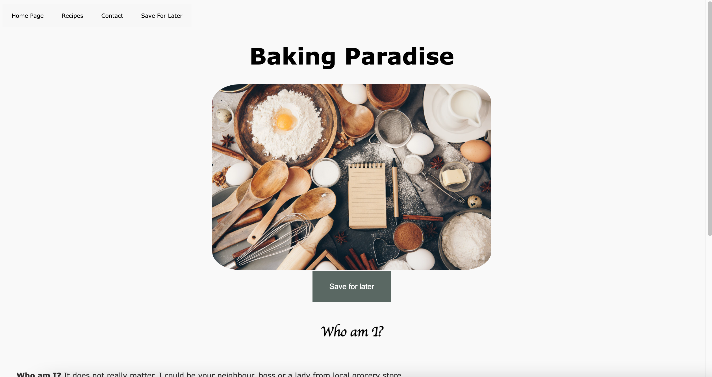
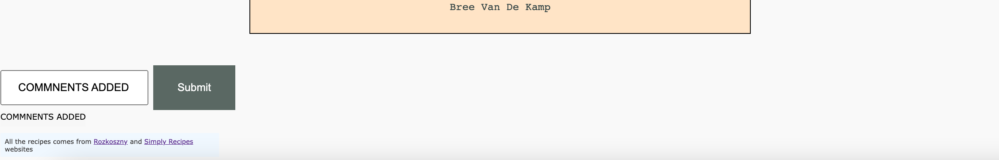
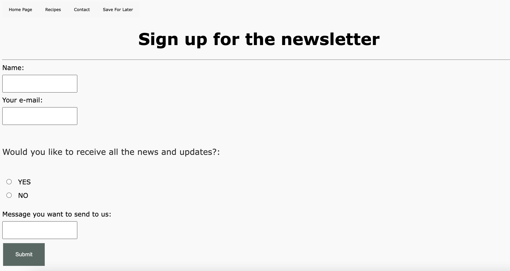

# Task 42 - Capstone Project VI - Build a complete website

This is the simple responsive website with recipes that user can add to the local storage and view them later in the special subpage called "Save For Later". Other than that user can leave a comment, like specific section and send the message using input form. 

## Table of content

1/ Installation
2/ Usage
3/ Credits

## 1/Installation

After downloading the folder to your local machine, just open index.html and enjoy the page

## 2/Usage

Website contains 4 pages. index.html (which is a home page, recipes.html, contact.html and saveForLater.html).
On the main page user can see the header, navbar, credits section in the footer and use the comment form to leave the comment.
Recipes.html is the place where user can like or save for later specific photos or paragraphs.
contact.html is the place for the contact form
saveforlater.html, user can view previously saved sections and elements.

## 3/Credits

All the credits with styling and bulding this project going to me.
recipes and texts comes from rozkoszny.com and simplyrecipes.com